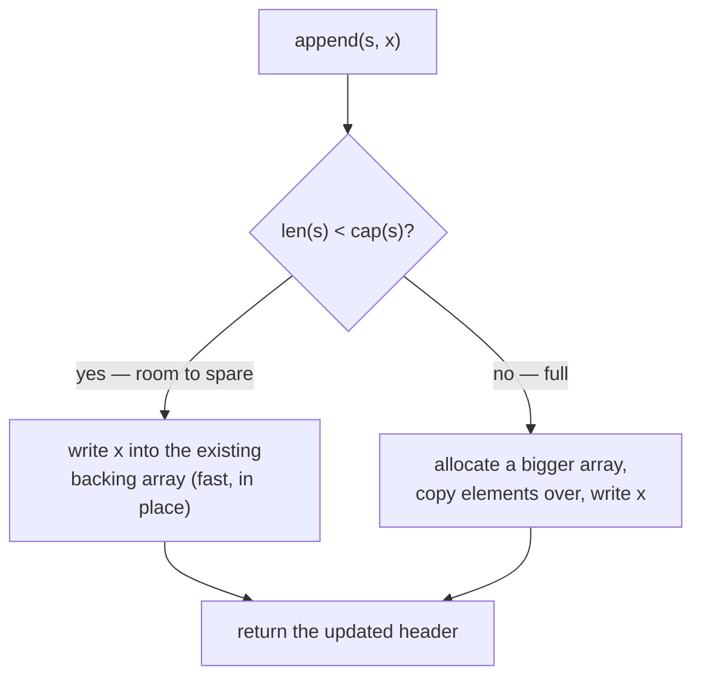

# Chapter 10: Collections

> **Arrays, slices (capacity, append, copy, gotchas), maps, range, and iterators (Go 1.23+).**

## TL;DR

Go's collections are **arrays** (fixed-size, rarely used directly), **slices** (dynamic
arrays — your workhorse), and **maps** (key-value, like JS objects/`Map`). The big
learning curve is **slices**: they're a small header pointing at a shared backing array,
and that sharing causes real bugs around capacity and sub-slicing. Master slices and
you've mastered the most-used data structure in Go.

Runnable demos for every section live in [`examples/`](./examples/) (`cd` into one and
`go run .`); the coding exercises live in [`exercises/`](./exercises/).

---

## Arrays — Fixed Size (Rarely Used Directly)

An array has a **fixed length that is part of its type**. `[3]int` and `[4]int` are
different types.

```go
var a [3]int                  // [0 0 0] — three ints, zero-valued
a[0] = 10
a[1] = 20
fmt.Println(a)                // [10 20 0]
fmt.Println(len(a))           // 3

b := [3]string{"a", "b", "c"} // array literal
c := [...]int{1, 2, 3, 4, 5}  // [...] lets the compiler count → [5]int
```

### Arrays Are Values (Copied on Assignment)

```go
a := [3]int{1, 2, 3}
b := a                        // COPIES the entire array
b[0] = 99
fmt.Println(a)                // [1 2 3] — unchanged
fmt.Println(b)                // [99 2 3]
```

This surprises JS developers — arrays in JS are references. In Go, an array _value_
denotes the whole array (not a pointer to its first element), so assigning or passing it
copies every element. That's why arrays are rarely used directly; you use **slices**
instead. You'll mostly meet arrays as the backing storage behind slices, or as fixed-size
buffers (`[1024]byte`) and hash outputs (`[32]byte` for SHA-256). → `examples/arrays`

---

## Slices — Your Workhorse

A slice is a dynamic, resizable view into an array. This is what you use 99% of the time —
the closest thing to a JavaScript array.

```go
nums := []int{1, 2, 3, 4, 5}  // slice literal (no size in brackets)
fmt.Println(len(nums))        // 5

var empty []int               // nil slice: len 0, ready to append
fmt.Println(empty == nil)     // true

s := make([]int, 3)           // [0 0 0] — length 3
```

### nil vs Empty Slice — a Real Gotcha

A `nil` slice (`var s []int`) and an empty non-nil slice (`[]int{}`) both have length 0
and behave identically for `len`, `range`, and `append` — but **they are not equal**, and
that difference leaks out at boundaries:

```go
var a []int
b := []int{}
fmt.Println(a == nil, b == nil) // true false

// encoding/json marshals them differently:
json.Marshal(a) // null
json.Marshal(b) // []
```

If an API must emit `[]` (not `null`) for "no results," return `[]T{}` or `make([]T, 0)` —
**not** a `nil` slice. Returning `nil` from a "found nothing" path is a common source of
`null`-instead-of-`[]` bugs. (A `nil` map marshals to `null` too; an initialized empty map
marshals to `{}`.)

### append — Growing a Slice

```go
nums := []int{1, 2, 3}
nums = append(nums, 4)        // [1 2 3 4]
nums = append(nums, 5, 6, 7)  // append multiple
nums = append(nums, more...)  // append another slice with ...

// Crucial: append RETURNS a (possibly new) slice — you must reassign
nums = append(nums, 8)        // ✅ reassign
append(nums, 8)               // ❌ result discarded — go vet flags this
```

**The #1 slice gotcha:** `append` may return a _new_ slice (if it had to grow the backing
array). You MUST reassign the result. Bare `append(nums, x)` compiles but throws the result
away — `go vet` catches it.

### JS Comparison

```javascript
// JavaScript — methods mutate in place, return the array or a new value
const nums = [1, 2, 3]
nums.push(4)                  // mutates → [1, 2, 3, 4]
const doubled = nums.map(x => x * 2)
const evens = nums.filter(x => x % 2 === 0)
```

```go
// Go — append returns a new slice; no built-in map/filter (use loops or generics)
nums := []int{1, 2, 3}
nums = append(nums, 4)        // must reassign

doubled := make([]int, len(nums))
for i, n := range nums {
    doubled[i] = n * 2
}
```

Go has no built-in `.map()`, `.filter()`, `.reduce()`. You write loops (or generics —
Chapter 12). This feels primitive coming from JS, but it's deliberate: explicit loops are
clear and hide no allocation.

---

## Length vs Capacity — The Key Slice Concept

A slice is a small **header** — three words — that points at a separate backing array:

```
   slice header                  backing array (in memory)
   ┌──────────────┐              ┌────┬────┬────┬────┬────┐
   │ ptr  ────────┼─────────────▶│ 10 │ 20 │ 30 │  0 │  0 │
   ├──────────────┤              └────┴────┴────┴────┴────┘
   │ len = 3      │                 ▲              ▲
   ├──────────────┤                 │              │
   │ cap = 5      │            len covers      cap covers
   └──────────────┘            these 3         all 5 slots

length   (len)  = elements you can access now (s[0]..s[len-1])
capacity (cap)  = total slots in the backing array before it must regrow
```

The header is tiny (a pointer + two integers); the data lives in the backing array. That
separation is why slices are cheap to pass (you copy the header, not the data) — and also
why the memory-sharing gotchas below exist (multiple headers can point at one array).

```go
s := make([]int, 3, 10)       // length 3, capacity 10
len(s)                        // 3
cap(s)                        // 10
s = append(s, 1)              // len 4, cap 10 — within cap, no reallocation
```

### What `append` Decides



The `no` branch is why you must reassign: after a regrow the header points at a _different_
array, and any other slice still pointing at the old one won't see the change.

### How Capacity Actually Grows (not clean powers of two)

Older tutorials say "capacity doubles." That's only half true, and the printed numbers are
**not** a neat `1, 2, 4, 8, 16`. The real algorithm (`runtime.nextslicecap`, called by
`growslice`) is:

- **Double** while the old capacity is **below 256**.
- Above 256, grow by roughly **1.25×** (a smooth transition, not a hard switch).
- Then round the byte request up to an **allocator size class**, so the final `cap` is
  often a bit larger than the raw formula.

Because of that final rounding, a small-element slice like `[]int` **starts at `cap 4`**,
not 1. Here's the real output on Go 1.26 appending to an empty `[]int` (→ `examples/slice-header`):

```
len= 1 cap= 4   ← first append rounds up to a size class
len= 5 cap= 8
len= 9 cap=16
len=17 cap=32
```

The first-allocation cap is **element-size dependent** (all land at 32 bytes): `[]byte`
starts at cap 32, `[]int32` at 8, `[]int` at 4, `[]string` at 2. And above the threshold
the growth is visibly sub-doubling, e.g. `cap 512 → 848 → 1280`. The takeaway is that
`append` is **O(1) amortized** — not that it follows a fixed sequence. Never hard-code the
capacity progression.

### Performance Tip: Preallocate When You Know the Size

```go
// ❌ Regrows several times as it fills
var results []int
for i := 0; i < 1000; i++ {
    results = append(results, i)
}

// ✅ One allocation, zero regrowth
results := make([]int, 0, 1000)   // length 0, capacity 1000
for i := 0; i < 1000; i++ {
    results = append(results, i)
}
```

When you know roughly how many elements you'll have, `make([]T, 0, n)` avoids the repeated
reallocations. A common, easy win.

---

## Slicing — Sub-slices Share Memory (Critical Gotcha)

You create a sub-slice with `s[low:high]` — but **sub-slices share the same backing array.**

```go
original := []int{1, 2, 3, 4, 5}
sub := original[1:4]          // [2 3 4]  — includes low, excludes high

sub[0] = 99                   // ⚠️ writes into the shared array
fmt.Println(original)         // [1 99 3 4 5] — original changed!
```

Two headers, one backing array:

```
original := []int{1, 2, 3, 4, 5}
sub := original[1:4]

   original header           shared backing array
   ┌─────────┐               ┌────┬────┬────┬────┬────┐
   │ ptr ────┼──────────────▶│  1 │  2 │  3 │  4 │  5 │
   │ len = 5 │               └────┴────┴────┴────┴────┘
   │ cap = 5 │                       ▲
   └─────────┘                       │
   sub header                        │ sub.ptr points HERE (index 1)
   ┌─────────┐                       │
   │ ptr ────┼───────────────────────┘
   │ len = 3 │               sub sees: [2, 3, 4]
   │ cap = 4 │               (cap = 4: index 1 to end of array)
   └─────────┘
```

`sub[0]` is physically the same cell as `original[1]`. Writing through one is visible
through the other. → `examples/subslice-sharing`

### Slicing Syntax

```go
s := []int{0, 1, 2, 3, 4, 5}

s[2:4]    // [2 3]          — index 2 up to (not including) 4
s[:3]     // [0 1 2]        — from start to index 3
s[3:]     // [3 4 5]        — from index 3 to end
s[:]      // [0 1 2 3 4 5]  — entire slice
```

Same `[start:end]` semantics as JavaScript's `.slice()` — **except** JS returns a copy,
while Go returns a shared view.

### The append-on-subslice Trap

```go
original := []int{1, 2, 3, 4, 5}
sub := original[0:2]          // [1 2], but cap is 5 (shares original's array)

sub = append(sub, 99)         // spare capacity → writes into original[2]!
fmt.Println(original)         // [1 2 99 4 5] — original corrupted!
```

`sub` has spare capacity reaching into `original`'s array, so `append` writes **in place**
instead of allocating:

```
sub := original[0:2]   →   len=2, cap=5

              sub sees      3 unused slots of spare capacity
              ┌────┐        ┌──────────────┐
   ┌────┬────┬────┬────┬────┐
   │  1 │  2 │  3 │  4 │  5 │   ← original
   └────┴────┴────┴────┴────┘
     0    1    2    3    4

append(sub, 99)  →  spare cap exists, so Go writes IN PLACE at index 2:

   ┌────┬────┬────┬────┬────┐
   │  1 │  2 │ 99 │  4 │  5 │   ← index 2 overwritten! original corrupted
   └────┴────┴────┴────┴────┘
```

Contrast with the regrow case: when capacity is _full_, `append` makes a new array (safe).
The danger appears only when a sub-slice has leftover capacity pointing into another
slice's data.

### The Fix: `slices.Clone`, `copy`, or the Full Slice Expression

```go
// Fix 1: an explicit independent copy
sub := slices.Clone(original[0:2])   // fresh backing array
sub = append(sub, 99)                // original untouched

// Fix 2: the three-index full slice expression s[low:high:max] caps the result
sub := original[0:2:2]               // cap = max-low = 2
sub = append(sub, 99)                // cap is full → forces reallocation, safe
```

The three-index slice `s[low:high:max]` sets capacity to `max-low`, forcing the next
`append` to allocate fresh memory instead of overwriting. Use it whenever you slice
something and intend to append to the result.

---

## copy — Duplicating Slice Data

```go
src := []int{1, 2, 3, 4, 5}
dst := make([]int, len(src))
n := copy(dst, src)           // copies min(len(dst), len(src)) elements
fmt.Println(dst, n)           // [1 2 3 4 5] 5

// The modern one-liner (Go 1.21+): slices.Clone
clone := slices.Clone(src)    // shallow copy; preserves nilness of src
```

`copy` needs `dst` to already have length (it copies into existing storage);
`slices.Clone` allocates and copies for you. → `examples/copy-clear`

## clear — Emptying in Place (Go 1.21)

The `clear` builtin works on both slices and maps, with type-appropriate meaning:

```go
s := []int{1, 2, 3}
clear(s)                      // [0 0 0] — zeroes every element; len/cap unchanged

m := map[string]int{"a": 1, "b": 2}
clear(m)                      // deletes every key; len(m) == 0
```

---

## The slices Package + min/max Builtins (Go 1.21+)

Modern Go has a standard `slices` package of generic helpers — finally some of JS's
array-method conveniences:

```go
import "slices"

s := []int{3, 1, 4, 1, 5, 9, 2, 6}

slices.Sort(s)                // sorts in place, ascending
slices.Contains(s, 4)         // true
slices.Index(s, 5)            // index of first 5, or -1
slices.Max(s)                 // 9   — ⚠️ panics on an empty slice
slices.Min(s)                 // 1   — ⚠️ panics on an empty slice
slices.Reverse(s)             // reverses in place

clone := slices.Clone(s)
slices.Equal(s, clone)        // true — element-wise

// Sort with a comparator — use cmp.Compare, not a-b (which can overflow)
slices.SortFunc(people, func(a, b Person) int {
    return cmp.Compare(a.Age, b.Age)   // ascending by age
})
```

Don't confuse the **`slices.Max`/`Min`** helpers (take a _slice_, panic on empty) with the
**`min`/`max` builtins** (Go 1.21, take scalar arguments):

```go
min(3, 1, 2)                  // 1  — builtin, variadic scalars
max(1.5, 2.5)                 // 2.5
```

### Handy slices helpers (reassign the result, like append)

| Function                         | Does                                                              |
| -------------------------------- | ----------------------------------------------------------------- |
| `slices.Delete(s, i, j)`         | remove `s[i:j]`, return the shorter slice                         |
| `slices.Insert(s, i, v...)`      | insert values at index `i`                                        |
| `slices.Concat(a, b, ...)`       | join slices into one                                              |
| `slices.Compact(s)`              | collapse **consecutive** duplicates (sort first for global dedup) |
| `slices.BinarySearch(s, target)` | `(index, found)` on a **sorted** slice                            |
| `slices.Sorted(seq)`             | collect an iterator into a sorted slice                           |

Before Go 1.21 you'd reach for the older, more verbose `sort` package. The `slices` package
is the modern way — use it.

---

## Maps — Key-Value Storage

Maps are Go's hash tables — like JavaScript's `Map` or a plain object.

```go
ages := map[string]int{"Alice": 30, "Bob": 25}   // literal

scores := make(map[string]int)                    // empty — MUST use make
scores["Charlie"] = 95

fmt.Println(ages["Alice"])    // 30
fmt.Println(ages["Zoe"])      // 0 — missing key returns the ZERO VALUE (not undefined)
```

### The "comma, ok" Idiom

Since a missing key returns the zero value, you can't tell "present with value 0" from
"absent" by the value alone. Use the two-value form:

```go
age, ok := ages["Bob"]        // 25, true
age, ok = ages["Zoe"]         // 0, false

if age, ok := ages["Alice"]; ok {
    fmt.Println("Alice is", age)
}
```

Same `value, ok` pattern as type assertions. In JS you'd use `"key" in obj` or
`.has()`; Go's `value, ok` is unambiguous.

### Deleting, Emptying, and Iterating

```go
delete(ages, "Bob")           // remove a key (no-op if absent or map is nil)
clear(ages)                   // remove ALL keys
len(ages)                     // number of keys

for key, value := range ages {   // ⚠️ order is RANDOM — never rely on it
    fmt.Printf("%s: %d\n", key, value)
}
```

**Map iteration order is randomized — deliberately.** Each iteration may differ; the Go
team randomized it so code can't accidentally depend on an order that was never guaranteed.
For deterministic output, sort the keys (→ `examples/maps`):

```go
for _, k := range slices.Sorted(maps.Keys(ages)) {
    fmt.Printf("%s: %d\n", k, ages[k])
}
```

### A nil Map: Reads OK, Writes Panic

```go
var m map[string]int
_ = m["key"]                  // fine — returns 0
m["key"] = 1                  // panic: assignment to entry in nil map
```

Always `make` a map (or use a literal) before writing.

### Maps of Structs — Values Aren't Addressable

```go
type Point struct{ X, Y int }
m := map[string]Point{"a": {1, 2}}

// m["a"].X = 10              // ❌ compile error: cannot assign to struct field in map

p := m["a"]; p.X = 10; m["a"] = p   // ✅ replace the whole value

m2 := map[string]*Point{"a": {1, 2}}
m2["a"].X = 10                // ✅ map of pointers — modify through the pointer
```

Map values aren't addressable, so you can't assign to a struct field in place. Use a
`map[K]*V` when you need to mutate values.

### Under the Hood (Go 1.24)

Go's map is a hash table; since Go 1.24 it uses a **Swiss Tables** implementation
internally — faster, with the same observable behavior (random order, nil-write panic,
comma-ok, non-addressable values all unchanged). It's an implementation detail; you don't
write code differently for it.

### maps package helpers (Go 1.21+)

| Function              | Does                                         |
| --------------------- | -------------------------------------------- |
| `maps.Clone(m)`       | shallow copy of the map                      |
| `maps.Copy(dst, src)` | merge `src` into `dst`                       |
| `maps.Equal(a, b)`    | element-wise equality (`==` on values)       |
| `maps.Keys(m)`        | **iterator** over keys (Go 1.23 — see below) |
| `maps.Values(m)`      | **iterator** over values                     |

### JS Comparison

```javascript
const ages = new Map([["Alice", 30], ["Bob", 25]])
ages.get("Alice")             // 30
ages.has("Alice")             // true
ages.delete("Bob")
for (const [k, v] of ages) {} // insertion order preserved!
```

```go
ages := map[string]int{"Alice": 30, "Bob": 25}
ages["Alice"]                 // 30
_, ok := ages["Alice"]        // existence check
delete(ages, "Bob")
for k, v := range ages {}     // RANDOM order!
```

Key differences from JS: missing key returns the zero value (not `undefined`); existence
is `value, ok :=` (not `in` / `.has()`); **iteration order is random** (JS `Map` preserves
insertion order); you can't compare maps with `==` (use `maps.Equal`).

---

## range and the Go 1.22 Loop Variable

`range` iterates the four collection-ish things — slices/arrays, maps, strings — and, since
Go 1.22, **integers**:

```go
for i, v := range []string{"a", "b"} {}  // index, value
for k, v := range map[string]int{} {}    // key, value (random order)
for i, r := range "héllo" {}             // byte index, rune
for i := range 5 {}                      // Go 1.22: i = 0,1,2,3,4
```

### The loop variable is now per-iteration (Go 1.22)

Before Go 1.22 the loop variable was created **once** and reused, so anything that captured
it — a closure or a goroutine — saw the _last_ value. That was the notorious
"loop-variable capture" bug. In Go 1.22 **each iteration creates a new variable**:

```go
funcs := []func(){}
for i := range 3 {
    funcs = append(funcs, func() { fmt.Print(i, " ") })
}
for _, f := range funcs {
    f()                       // Go 1.22+: 0 1 2   (pre-1.22: 3 3 3)
}
```

Coming from JS, this is the difference between `var` and `let` in a loop — Go now behaves
like `let`. Both Go 1.22 changes are _language_ changes gated on the `go` directive: they
apply only to modules whose `go.mod` declares `go 1.22` or later (this repo does).

---

## Iterators (Go 1.23+) — range over functions

The newest addition to Go's iteration toolkit. Since Go 1.23 you can `range` over a
function of the right shape, enabling custom, lazy iterators — conceptually like JS
generators.

```go
import "iter"

// iter.Seq[T] is func(yield func(T) bool). yield returns false when the
// consumer breaks, so the producer can stop early.
func Countdown(from int) iter.Seq[int] {
    return func(yield func(int) bool) {
        for i := from; i > 0; i-- {
            if !yield(i) {
                return
            }
        }
    }
}

for n := range Countdown(5) {
    fmt.Println(n)            // 5, 4, 3, 2, 1
}
```

This enables lazy sequences without materializing whole collections. The `slices` and
`maps` packages plug into it (→ `examples/iterators`):

```go
m := map[string]int{"a": 1, "b": 2, "c": 3}

keys := slices.Collect(maps.Keys(m))     // iterator → slice
slices.Sort(keys)

sorted := slices.Sorted(maps.Keys(m))    // collect + sort in one call
```

> **Version gotcha:** the **stdlib** `maps.Keys` (Go 1.23) returns an **iterator**
> (`iter.Seq[K]`), so you `slices.Collect` or `slices.Sorted` it to get a slice. Older
> tutorials showing `keys := maps.Keys(m)` yielding a `[]K` are using the _experimental_
> `golang.org/x/exp/maps`, whose `Keys` returned a slice. With the stdlib you must collect.

### JS Comparison

```javascript
function* countdown(from) {
    for (let i = from; i > 0; i--) yield i
}
for (const n of countdown(5)) console.log(n)   // 5 4 3 2 1
```

Go's iterators are a bit more verbose (the `yield func(T) bool` callback) but achieve the
same lazy iteration. It's an advanced feature — you won't reach for it early, but it's good
to know modern Go has it; many older tutorials predate it entirely.

---

## Common Mistakes

### 1. Forgetting to reassign append

```go
append(nums, 4)               // ❌ result discarded (go vet warns)
nums = append(nums, 4)        // ✅
```

### 2. Sub-slice memory-sharing bugs

```go
sub := original[1:3]
sub[0] = 99                   // ⚠️ modifies original too
sub := slices.Clone(original[1:3])   // ✅ independent copy
```

### 3. Writing to a nil map

```go
var m map[string]int
m["key"] = 1                  // ❌ panic
m = make(map[string]int)      // ✅ then write
```

### 4. Relying on map iteration order

```go
for k, v := range m {}                       // ❌ random each run
for _, k := range slices.Sorted(maps.Keys(m)) {}   // ✅ deterministic
```

### 5. Comparing slices or maps with ==

```go
// if slice1 == slice2 {}     // ❌ compile error (only == nil is allowed)
if slices.Equal(a, b) {}      // ✅
if maps.Equal(m1, m2) {}      // ✅
```

### 6. Returning nil where the caller expects []

```go
return nil                    // marshals to null
return []Result{}             // ✅ marshals to [] for "no results"
```

---

## Key Takeaways

1. **Slices are your workhorse, not arrays.** Arrays are fixed-size values (copied on
   assignment); slices are dynamic headers over a shared backing array.

2. **`append` returns a new slice — always reassign.** `s = append(s, x)`, never bare
   `append(s, x)`.

3. **Capacity growth isn't clean doubling.** Go doubles below ~256 elements, then grows
   ~1.25×, then rounds up to a size class — so `[]int` starts at cap 4 and printed caps
   aren't powers of two. Preallocate with `make([]T, 0, n)` when you know the size.

4. **Sub-slices share memory.** Slicing gives a window into the same array; appending into
   a sub-slice's spare capacity corrupts the parent. Use `slices.Clone` or the three-index
   slice `s[lo:hi:max]`.

5. **`nil` vs empty matters at the edges** — both are len 0, but a `nil` slice/map marshals
   to `null` while `[]T{}` / `map{}` marshal to `[]` / `{}`.

6. **Maps: missing keys return zero values.** Use `value, ok :=` to check existence;
   `make` before writing; iteration order is **random** — sort keys for determinism.

7. **Reach for modern stdlib.** `min`/`max`/`clear` builtins and the `slices`/`maps`
   packages (Go 1.21+), the Go 1.22 per-iteration loop variable and `range n`, and Go 1.23
   iterators — many older tutorials don't cover these.

---

## 🧭 Navigation

| Direction    | Link                                                                     |
| ------------ | ------------------------------------------------------------------------ |
| **Previous** | [← Chapter 09: Error Handling](../09-error-handling/README.md)           |
| **Next**     | [Chapter 11: Packages & Modules →](../11-packages-and-modules/README.md) |
