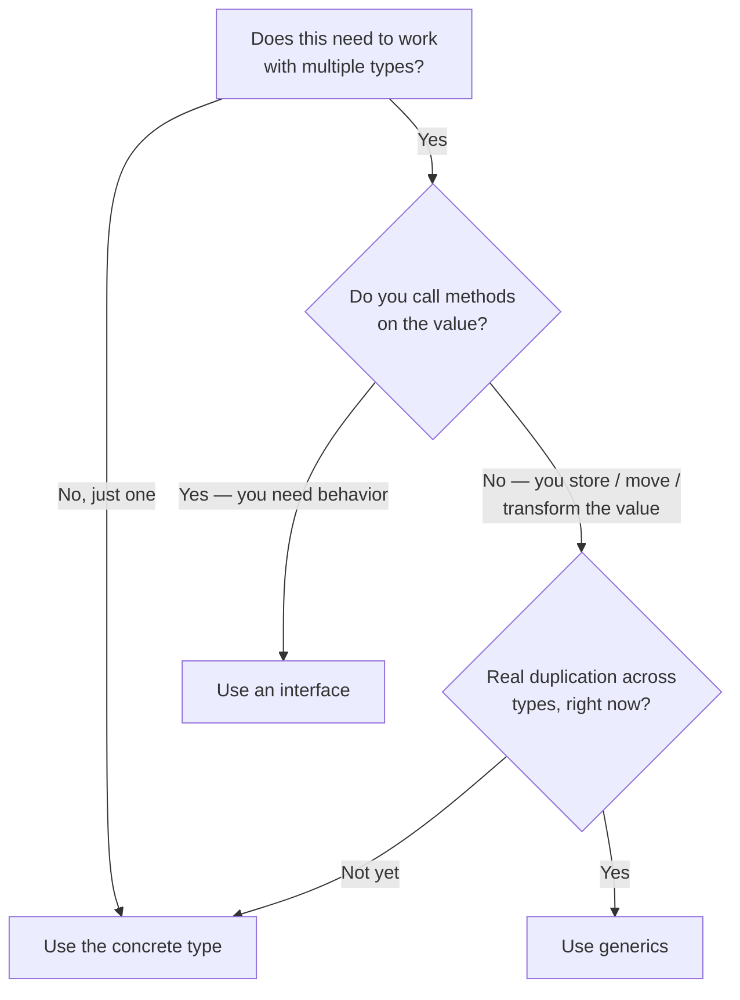

# Chapter 12: Generics

> **Type parameters, constraints, when to use vs when not to, and a comparison with TypeScript generics.**

## TL;DR

Generics arrived in Go 1.18 (2022) after 13 years of debate. They let you write functions and types that work across many types while keeping compile-time type safety — no `any`, no type assertions. As a TypeScript developer the syntax feels familiar (`[T any]` instead of `<T>`). The Go-specific wisdom: **start with concrete types, reach for generics only when you have real duplication across types.** Don't generic-ify everything.

---

## The Problem Generics Solve

Before generics, a function that worked with multiple types had two bad options.

### Option 1 — duplicate the code

```go
func MaxInt(a, b int) int {
	if a > b {
		return a
	}
	return b
}

func MaxFloat(a, b float64) float64 {
	if a > b {
		return a
	}
	return b
}

func MaxString(a, b string) string { /* …same body again… */ }
// One copy per type. Tedious and unmaintainable.
```

### Option 2 — use `any` and lose type safety

```go
func Max(a, b any) any {
	// need type assertions, runtime checks, can return the wrong type…
}

result := Max(3, 5)
n := result.(int) // must assert the type back — a runtime risk
```

### The generic solution

```go
import "cmp"

// One function, type-safe, works for many types.
func Max[T cmp.Ordered](a, b T) T {
	if a > b {
		return a
	}
	return b
}

Max(3, 5)              // 5      (T inferred as int)
Max(3.2, 1.8)          // 3.2    (T inferred as float64)
Max("apple", "banana") // banana (T inferred as string)
```

One function. Full type safety. Type inference means you usually don't even name `T`. That is what generics buy you.

> Runnable: [`examples/type-params/`](./examples/type-params/) — `Max`, `Map`, and inference.

---

## Type Parameters: The Syntax

A generic function declares **type parameters** in square brackets before the ordinary parameters:

```go
func FunctionName[T Constraint](params) ReturnType {
	// T is a type usable throughout the function
}
```

```go
func Print[T any](value T) {
	fmt.Println(value)
}

Print(42)          // T = int
Print("hello")     // T = string
Print([]int{1, 2}) // T = []int
```

### Multiple Type Parameters

```go
// Map transforms a []T into a []U.
func Map[T, U any](s []T, transform func(T) U) []U {
	result := make([]U, len(s))
	for i, v := range s {
		result[i] = transform(v)
	}
	return result
}

nums := []int{1, 2, 3}
strs := Map(nums, func(n int) string { return fmt.Sprintf("#%d", n) })
fmt.Println(strs) // [#1 #2 #3]   — T=int, U=string
```

This is the `map()` JS has built in — but in Go you write it once, and it's type-safe.

### JS/TS Comparison

```typescript
// TypeScript: angle brackets <T>
function max<T>(a: T, b: T): T {
	return a > b ? a : b;
}
function map<T, U>(arr: T[], fn: (item: T) => U): U[] {
	return arr.map(fn);
}
```

```go
// Go: square brackets [T]
func Max[T cmp.Ordered](a, b T) T { /* … */ }
func Map[T, U any](s []T, fn func(T) U) []U { /* … */ }
```

The concepts map almost directly:

- `<T>` → `[T any]`
- `<T, U>` → `[T, U any]`
- TS uses `extends` for constraints → Go uses constraint interfaces

Why square brackets? Angle brackets are ambiguous to parse: `f<T>(true)` could be a call to `f<T>` _or_ the comparison `f < T` followed by `(true)`. Go sidesteps that with `[]` — and it requires an explicit **constraint** on every type parameter, more often than TypeScript does.

---

## Constraints: Limiting What Types Are Allowed

A type parameter needs a **constraint** — a statement of which types are permitted and, therefore, which operations are available inside the function. The constraint follows the type parameter name.

### The `any` Constraint

```go
func Print[T any](value T) {
	fmt.Println(value) // OK — Println accepts anything
	// value + value   // ❌ can't use + — not every type supports it
}
```

With `any` you can store, pass, and print the value — but not use operators like `+`, `<`, or `==`, because not all types support them. (`any` is just an alias for `interface{}`.)

### The `comparable` Constraint

```go
// comparable = types usable with == and != (and as map keys).
func Contains[T comparable](slice []T, target T) bool {
	for _, v := range slice {
		if v == target { // == is allowed because T is comparable
			return true
		}
	}
	return false
}

Contains([]int{1, 2, 3}, 2)       // true
Contains([]string{"a", "b"}, "c") // false
```

`comparable` is the built-in constraint for types usable with `==`/`!=` (precisely: _strictly comparable_ types).

> **Go 1.20 relaxation:** ordinary interface types now _satisfy_ `comparable` too, even though comparing them can panic at runtime. That's why `Set[any]` or `map[any]V` are legal since Go 1.20 — before that, only strictly comparable types were allowed.

### The `cmp.Ordered` Constraint

```go
import "cmp"

// cmp.Ordered = types supporting <, <=, >, >=.
func Max[T cmp.Ordered](a, b T) T {
	if a > b { // > is allowed because T is Ordered
		return a
	}
	return b
}
```

`cmp.Ordered` (from the standard `cmp` package, Go 1.21+) covers every ordered type: integers, floats, and strings. Its definition uses `~` (see below), so **defined types** like `type Celsius float64` satisfy it too.

> For the 2-argument case you often don't need a generic `Max` at all — the built-in **`min`** and **`max`** (Go 1.21) already work over ordered types: `max(3, 5)` is `5`. Reserve a generic `Max` / `slices.Max` for whole slices. (`clear`, also 1.21, zeroes a slice or empties a map — and works on a type-parameter-typed value.)

### Custom Constraints — Type Sets and Unions

You can define your own constraint as an interface holding a **type set** — a list of allowed types joined with `|`:

```go
type Number interface {
	int | int8 | int16 | int32 | int64 |
		uint | uint8 | uint16 | uint32 | uint64 |
		float32 | float64
}

func Sum[T Number](nums []T) T {
	var total T // the zero value of T
	for _, n := range nums {
		total += n // + is allowed — every type in Number supports it
	}
	return total
}

Sum([]int{1, 2, 3})      // 6
Sum([]float64{1.5, 2.5}) // 4.0
```

Inside the function you may use any operation that **all** listed types support (here, `+`). A union can't mix in methods, and its non-interface terms must be disjoint.

### The `~` Approximation Token

`~T` means "all types whose underlying type is `T`":

```go
type Celsius float64 // a defined type; underlying type float64

type Number interface {
	~int | ~float64 // ~ includes defined types built on these
}

func Double[T Number](n T) T { return n * 2 }

Double(Celsius(20)) // ✅ works — Celsius's underlying type is float64
// Without ~, Celsius would NOT satisfy the constraint.
```

Use `~` when your generic should accept custom types built on the base types (like `Celsius` from Chapter 3). Without it, only the _exact_ types match. Most general-purpose constraints use `~` to stay flexible — `cmp.Ordered` and every constraint in `x/exp/constraints` do. (Rule: in `~T`, `T`'s underlying type must be itself, and `T` can't be an interface — so `~error` is illegal.)

> Runnable: [`examples/constraints/`](./examples/constraints/) — `any`, `comparable`, `Number` union with `~`, and `cmp.Compare`.

### Where the Batteries Live (the stdlib landscape)

As of Go 1.26 most common generics ship in the standard library — you rarely define constraints by hand:

- **`cmp`** (1.21): `cmp.Ordered`, `cmp.Compare`, `cmp.Less`, `cmp.Or`.
- **`slices`** (1.21, extended 1.23): `Sort`, `SortFunc`, `Contains`, `Index`, `Max`, `Min`, `Clone`, `Equal`, `Collect`, `Sorted`, … (all generic).
- **`maps`** (1.21, iterators 1.23): `Clone`, `Copy`, `Equal`, `Keys`, `Values`.
- **`golang.org/x/exp/constraints`** is now _mostly redundant_ — its `Ordered` is literally `= cmp.Ordered`. Import it only for `Signed`, `Unsigned`, `Integer`, `Float`, or `Complex`, which the stdlib still doesn't provide.

Note that `slices` has **no** `Map`/`Filter`/`Reduce` — those stay worth writing by hand (Exercise 1), so don't hunt for `slices.Map`.

---

## Generic Types (Not Just Functions)

You can make struct types generic — the foundation for type-safe containers.

### A Generic Stack

```go
type Stack[T any] struct {
	items []T
}

func (s *Stack[T]) Push(item T) {
	s.items = append(s.items, item)
}

func (s *Stack[T]) Pop() (T, bool) {
	var zero T
	if len(s.items) == 0 {
		return zero, false // zero value + false when empty
	}
	last := s.items[len(s.items)-1]
	s.items = s.items[:len(s.items)-1]
	return last, true
}

func (s *Stack[T]) Len() int { return len(s.items) }
```

Usage — fully type-safe:

```go
intStack := &Stack[int]{}
intStack.Push(1)
intStack.Push(2)
val, ok := intStack.Pop() // val is int (2), ok is true

strStack := &Stack[string]{}
strStack.Push("hello")
// strStack.Push(42)      // ❌ compile error — type-safe!
```

No `any`, no assertions. `Stack[int]` accepts only ints; the compiler enforces it. Note that **methods repeat the type parameter** — `func (s *Stack[T])` — because the receiver must name the type it operates on.

#### Generic Methods — Go 1.26 vs Go 1.27

Whether a method can declare its _own_ extra type parameter (beyond the receiver's) changed with the release that landed on 2026-08-19. Take a `List[E]` that wants a `MapTo` turning each element into a new type `F`:

```go
type List[E any] struct{ items []E }

func (l List[E]) MapTo[F any](f func(E) F) List[F] { /* … */ }
```

| Case                                                         | Go 1.26 (this repo's target)             | Go 1.27+                         |
| ------------------------------------------------------------ | ---------------------------------------- | -------------------------------- |
| Method with its own type parameter (`MapTo[F any]`)          | ❌ `method must have no type parameters` | ✅ allowed on **concrete** types |
| An _interface_ method declaring a type parameter             | ❌                                       | ❌ still not allowed             |
| A generic method used to _implement_ a non-generic interface | ❌                                       | ❌ still not allowed             |

- **Before (Go 1.26):** you work around it with a package-level generic **function**, which lives in the whole package's namespace rather than the type's:

  ```go
  func MapList[E, F any](l List[E], f func(E) F) List[F] { /* … */ }
  ```

- **After (Go 1.27):** the same logic can live on the type as a method. The stdlib already uses it — `math/rand/v2` now ships `(*Rand) N[Int intType](Int) Int` as a **method**, where before it was only a package-level function.

Interface methods stay off-limits in both. **This repo builds on Go 1.26**, so the examples avoid generic methods — but if you read the _live_ spec (already the 1.27 tip), you'll see the method-with-type-parameter form documented, so don't be surprised when 1.26 rejects it.

### A Generic Pair

```go
type Pair[K comparable, V any] struct {
	Key   K
	Value V
}

p := Pair[string, int]{Key: "age", Value: 30}
fmt.Println(p.Key, p.Value) // age 30
```

> **Generic type aliases** (Go 1.24) let an _alias_ carry type parameters too, handy for shortening long instantiations: `type StringMap[V any] = map[string]V`.

### JS/TS Comparison

```typescript
class Stack<T> {
	private items: T[] = [];
	push(item: T): void {
		this.items.push(item);
	}
	pop(): T | undefined {
		return this.items.pop();
	}
}
const s = new Stack<number>();
```

```go
type Stack[T any] struct{ items []T }
func (s *Stack[T]) Push(item T)     { s.items = append(s.items, item) }
func (s *Stack[T]) Pop() (T, bool)  { /* … */ }

s := &Stack[int]{}
```

Very similar. TypeScript infers the type parameter from the class context; Go restates it on each method (`func (s *Stack[T])`) and is more explicit.

> Runnable: [`examples/generic-stack/`](./examples/generic-stack/) — `Stack[T]` and `Pair[K, V]`.

---

## Type Inference

Usually you don't name the type parameter — Go infers it from the ordinary arguments:

```go
Max(3, 5)     // inferred: Max[int]
Max(3.2, 1.8) // inferred: Max[float64]

Max[int](3, 5) // explicit — rarely needed
```

Inference reads the type off the **arguments**, so a typed slice carries its element type even when empty:

```go
Sum([]int{})     // Sum[int] — the []int type tells Go that T = int
var xs []int
Sum(xs)          // also Sum[int] — length is irrelevant
```

Inference fails only when the type parameter **doesn't appear in the parameters** — for instance when it appears only in the return type, so there is nothing to infer from. Then you must instantiate explicitly:

```go
func New[T any]() *Stack[T] { return &Stack[T]{} }

s := New[int]() // must specify [int] — no argument mentions T
```

> **Go 1.27 widened inference.** Assigning or converting a generic function to a matching function-typed variable now infers its type arguments from the target type — so `var f func(int, int) int = Max` deduces `Max[int]`. **Before (Go 1.26)** that line was a compile error; you had to write `= Max[int]`. **After (Go 1.27)** the target type is enough. (Argument-based inference, above, works the same on both.)

## When to Use Generics — The Critical Judgment

This is the most important section. Generics are powerful but easily overused. The Go team's official guidance ("[When To Use Generics](https://go.dev/blog/when-generics)") is: **write code, don't design types** — start by writing ordinary functions, and reach for a type parameter only when you find yourself writing _the same code_ where the only difference is the types.



### ✅ Use generics when

**1. You operate on slices, maps, or channels of any element type**

```go
func Filter[T any](s []T, keep func(T) bool) []T { /* … */ }
```

**2. You're building a general-purpose data structure**

```go
type Set[T comparable] struct{ /* … */ }
type Cache[K comparable, V any] struct{ /* … */ }
```

**3. Different types need the same method body** — the code is identical, only the type changes.

### ❌ Don't use generics when

**1. You only ever use one type** — just write the concrete type.

```go
// ❌ pointless — only ever called with User
func Process[T User](u T) { /* … */ }
// ✅
func Process(u User) { /* … */ }
```

**2. An interface fits better** — when you need _behavior_, not _type flexibility_.

```go
// ❌ generic for behavior
func Save[T io.Writer](w T) { w.Write(nil) }
// ✅ interface for behavior
func Save(w io.Writer) { w.Write(nil) }
```

The key distinction, straight from the blog: **need behavior (methods to call) → interface; need type-safe reuse across data shapes → generics.**

**3. It makes the code harder to read** — marginal reuse isn't worth the complexity.

### The Golden Rule

> **Start with concrete types. Refactor to generics only when real duplication appears.**

Don't design generic "just in case." Write the concrete version; when you copy-paste the same logic for a second or third type, _that's_ the signal to extract a generic. This mirrors the interface advice from Chapter 7: abstractions should emerge from need, not speculation.

---

## Generics vs Interfaces — The Decision

Both provide a form of polymorphism, but they solve different problems.

|                                 | Interface                          | Generic                             |
| ------------------------------- | ---------------------------------- | ----------------------------------- |
| **Purpose**                     | Abstract over _behavior_ (methods) | Abstract over _types_ (data shapes) |
| **Question it answers**         | "What can this thing DO?"          | "What TYPE is this?"                |
| **Type known at compile time?** | No — dynamic dispatch              | Yes — concrete type per instance    |
| **Example**                     | `io.Reader` (anything readable)    | `Stack[T]` (a stack of any type)    |
| **Use when**                    | You call methods on the value      | You store/transform varying types   |

```go
// Interface — you care about what it DOES (has a Read method)
func ReadAll(r io.Reader) []byte { /* … */ }

// Generic — you care about the TYPE flowing through
func First[T any](s []T) T { return s[0] }
```

Heuristic: if the function body **calls methods** on the parameter, an interface is probably right. If it just **moves values around** (stores, returns, transforms without calling type-specific methods), a generic fits.

---

## Performance Note

Go implements generics with **GC-shape stenciling plus dictionaries**: the compiler emits one instantiation per "GC shape" (crucially, **all pointer types share a single shape**), and passes a runtime **dictionary** describing the exact type arguments. It's a deliberate middle ground — _not_ C++/Rust-style monomorphization (one specialized copy per concrete type), and _not_ fully boxed generics. In practice:

- Generic code is almost always faster than the `any` + type-assertion approach it replaces (no boxing, no runtime assertions).
- For value types it usually has **zero or negligible** overhead versus hand-written concrete code.
- Because pointer instantiations are _shared_, generic code over pointer/interface types can occasionally be _slightly_ slower (dictionary indirection), and specialization can add a little **binary size**.

Don't worry about generics performance for normal code. If you're in a hot path, benchmark it (Chapter 34 covers profiling).

---

## Common Mistakes

### Mistake 1 — generic-ifying everything

```go
// ❌ over-engineered — you only ever reverse []string
func Reverse[T any](s []T) []T { /* … */ }
// ✅ concrete until you actually need multiple types
func ReverseStrings(s []string) []string { /* … */ }
```

### Mistake 2 — using generics when an interface fits

```go
// ❌ generic for behavior
func Log[T fmt.Stringer](v T) { fmt.Println(v.String()) }
// ✅ interface for behavior
func Log(v fmt.Stringer) { fmt.Println(v.String()) }
```

If you're calling methods, use an interface.

### Mistake 3 — over-complex constraints

```go
// ❌ hard to read, marginal benefit
func Process[T interface{ ~[]E }, E interface{ ~int | ~string }](data T) { /* … */ }
// ✅ keep constraints simple — if it's this complex, reconsider the design
```

### Mistake 4 — forgetting the zero-value pattern

```go
func GetOrZero[T any](m map[string]T, key string) T {
	var zero T // ✅ the correct way to get T's zero value
	if v, ok := m[key]; ok {
		return v
	}
	return zero
}
```

You can't `return nil` or `return 0` for an arbitrary `T` — use `var zero T`.

---

## Exercises

The three exercises in [`exercises/`](./exercises/) build the classic generic toolkit. Each
ships with a table-driven `_test.go` guarded by `t.Skip(...)`; remove the Skip and
implement until `go test ./...` passes.

### Exercise 1 — Generic slice utilities (`sliceutil.go`)

Implement type-safe `Map[T, U]`, `Filter[T]`, and `Reduce[T, U]`. These are the JS array
methods, written once with generics. (They are deliberately _not_ in the stdlib `slices`
package — writing them is the drill.)

### Exercise 2 — Generic `Set` (`set.go`)

Build a `Set[T comparable]` backed by `map[T]struct{}` (the empty struct uses zero memory),
with `Add`, `Remove`, `Contains`, `Len`, and `Items`. The `comparable` constraint is exactly
the map-key requirement.

### Exercise 3 — Generic `Result` (`result.go`)

Create a `Result[T any]` holding either a value or an error (inspired by Rust), with `Ok`,
`Err`, `IsOk`, `Unwrap`, and `UnwrapOr`. Watch where `var zero T` matters.

### Exercise 4 — When NOT to use generics (on paper)

For each signature, decide **generic, interface, or concrete** — and justify it:

1. writes formatted output to "anything writable";
2. finds the maximum in a slice of numbers _or_ strings;
3. validates a `User` struct's fields.

<details>
<summary>Answers</summary>

1. **interface** `io.Writer` — you need behavior (a `Write` method).
2. **generic** `[T cmp.Ordered]` — same body, only the type varies.
3. **concrete** `User` — one type, no reuse; neither generics nor interfaces earn their keep.

</details>

---

## Key Takeaways

1. **Generics provide type-safe reuse across types** without `any` or assertions. Syntax: `[T Constraint]` — square brackets, because `<>` is ambiguous to parse.

2. **Constraints define the allowed types and operations.** `any` (anything), `comparable` (`==`/`!=`; since Go 1.20 interfaces satisfy it too), `cmp.Ordered` (`<`/`>`), or a custom constraint with a type union (`int | float64`). Use `~` to include defined types.

3. **Generic types enable type-safe containers** — `Stack[T]`, `Set[T]`, `Cache[K, V]`. Methods restate the type parameter: `func (s *Stack[T])`. (Go 1.27 adds generic methods on concrete types; 1.26 doesn't.)

4. **Type inference usually means you don't name the type** — `Max(3, 5)`, not `Max[int](3, 5)`. It fails only when the type parameter isn't in the arguments (e.g. return-only), like `New[int]()`.

5. **Interface for behavior, generic for type flexibility.** Call methods → interface. Move values of varying types → generic.

6. **Start concrete, refactor to generics on real duplication.** Don't generic-ify speculatively — the strong Go consensus. Generics enhance Go's simplicity only when used judiciously.

---

## 🧭 Navigation

| Direction    | Link                                                                     |
| ------------ | ------------------------------------------------------------------------ |
| **Previous** | [← Chapter 11: Packages & Modules](../11-packages-and-modules/README.md) |
| **Next**     | [Chapter 13: Testing →](../13-testing/README.md)                         |
