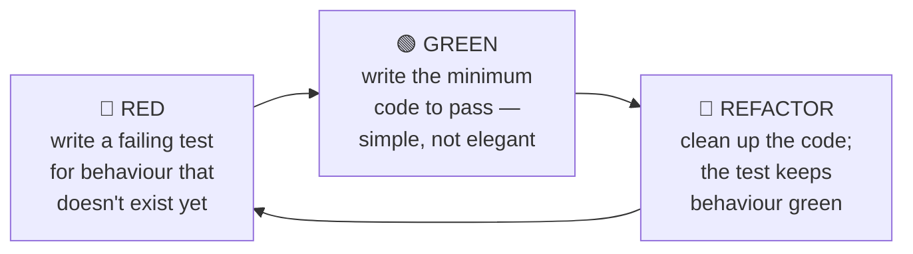

# Chapter 13: Testing

> **Built-in testing, the kinds of tests and when each earns its keep, table-driven
> tests, coverage, benchmarks, fuzzing, and testify basics — plus how real Go projects
> actually test.**

## TL;DR

Testing is built into Go — no Jest, no Mocha, no config. Write a function named
`TestXxx` in a `_test.go` file, run `go test`. The idiomatic pattern is
**table-driven tests**: define cases as data, loop over them with subtests. Go's
testing philosophy matches its language philosophy: simple, built-in, no magic. This
chapter also steps back from mechanics to answer the questions that matter in real
work — _what kinds of tests exist, which to prioritise, and what makes a test worth
writing_ — then shows how the standard library and popular Go projects test. You'll use
exactly these patterns to test **`gitm`**, your Part 1 milestone project.

---

## Why Test At All? (The Honest Version)

Tests are not about proving your code is correct — you can't prove that. Tests are
about **buying confidence to change code**. A codebase without tests calcifies: every
change is scary because nothing tells you what you broke. A well-tested codebase is one
you can refactor fearlessly, because the tests are a tripwire.

Three concrete things tests buy you:

1. **A safety net for change** — rename, refactor, upgrade a dependency, and `go test`
   tells you in seconds whether behaviour still holds.
2. **Executable documentation** — a good test shows _how_ a function is meant to be
   called and _what_ it returns, and unlike a comment it can never drift out of date
   (it fails if it lies).
3. **Design pressure** — code that is hard to test is usually badly designed
   (hidden dependencies, doing too much). Writing the test first often exposes the
   problem before it ships.

The trap on the other side: tests are code you also have to maintain. A brittle test
that breaks on every harmless change is worse than no test. The whole craft is writing
tests that catch _real_ breakage and stay quiet otherwise. We come back to this in
[What Makes a Test Worth Writing](#what-makes-a-test-worth-writing).

---

## The Testing Landscape — Kinds of Tests

Before Go specifics, the vocabulary. These terms describe the **scope** of what a test
exercises, from smallest to largest. The industry sketch is the **test pyramid**: many
small fast tests at the bottom, few large slow ones at the top.

```
       ╱╲            End-to-End (E2E)      ← few: whole system, real UI/CLI,
      ╱  ╲                                    slow, brittle, expensive
     ╱────╲
    ╱      ╲         Integration           ← some: several real components
   ╱        ╲                                 together (code + real DB/HTTP)
  ╱──────────╲
 ╱            ╲      Unit                   ← many: one function/type in
╱______________╲                              isolation, fast, deterministic
```

- **Unit test** — exercises one small piece (a function, a method, a type) in
  isolation, with no network, disk, or database. Fast (microseconds), deterministic,
  runs on every save. This is the bulk of your tests. Most of this chapter is about
  writing good unit tests.
- **Integration test** — exercises several real components together: your code against
  a real database, a real HTTP server, the real filesystem. Slower and more setup, but
  catches the bugs unit tests can't — wiring, SQL, serialization, config. In Go these
  are still just `go test`; you gate the slow ones behind `testing.Short()` or a build
  tag so they don't run on every save.
- **End-to-end (E2E) test** — drives the whole system the way a user would: start the
  binary, hit the real CLI or HTTP API, assert on the output. Highest confidence,
  highest cost, most brittle. You want a few, covering critical happy paths.

Cutting across scope are other useful labels:

- **Regression test** — written to pin a specific bug so it never comes back. When you
  fix a bug, add a test that would have caught it.
- **Table-driven test** — not a scope but a _style_ (Go's dominant one); see below.
- **Benchmark** — measures speed/allocations, not correctness (`go test -bench`).
- **Fuzz test** — throws generated random inputs at a function to find crashes and edge
  cases you'd never write by hand (`go test -fuzz`).
- **Golden-file test** — compares output against a checked-in "golden" file
  (`testdata/`), regenerated with a `-update` flag. Common for formatters, templates,
  and codegen.

### Which to prioritise

For a backend/CLI developer, the honest priority order is:

1. **Unit tests of your core logic** — the functions with branches, edge cases, and
   arithmetic. Highest value per minute, run constantly. Write these first and most.
2. **A handful of integration tests** on the seams that actually break — your database
   queries, your HTTP handlers, your parsing. One real-DB test catches a class of bugs
   a hundred mocked tests miss.
3. **A thin layer of E2E** on the one or two paths that must never break (e.g. `gitm
   switch` actually changes the active account).

Don't invert the pyramid. A suite that is all slow E2E tests is flaky, slow to run, and
tells you _something_ broke but not _what_. The pyramid shape exists because fast
narrow tests localise failures.

### JS/TS comparison

You've met these ideas already, just with different tools. In the JS world unit and
integration tests use Jest/Vitest, E2E uses Playwright/Cypress, and each is a separate
dependency with its own config. **Go collapses the stack**: unit, integration,
benchmark, and fuzz all run through the one built-in `go test`, no framework to install.
E2E is the only tier where you typically reach outside `testing` (drive the built binary
from a shell or a Go test that `exec`s it).

---

## Your First Test

Testing in Go follows strict conventions that the `go test` command relies on:

```go
// file: math.go
package math

func Add(a, b int) int {
	return a + b
}
```

```go
// file: math_test.go     (must end in _test.go)
package math

import "testing"

func TestAdd(t *testing.T) { // must start with Test, take *testing.T
	got := Add(2, 3)
	want := 5
	if got != want {
		t.Errorf("Add(2, 3) = %d; want %d", got, want)
	}
}
```

Run it:

```bash
go test                  # run tests in the current package
go test -v               # verbose — show each test
go test ./...            # all tests in all packages
```

```
=== RUN   TestAdd
--- PASS: TestAdd (0.00s)
PASS
ok      github.com/you/proj/math    0.002s
```

The rules `go test` enforces:

- Test files end in `_test.go` (and are excluded from normal builds).
- Test functions start with `Test` followed by a capitalized name.
- They take exactly one parameter: `t *testing.T`.
- They live in the same package, **or** in `package foo_test` for _black-box_ testing
  (see [Black-Box vs White-Box](#black-box-vs-white-box-testing)).

### JS Comparison

```javascript
// JavaScript (Jest): separate framework, config, assertion library
// math.test.js
import { add } from "./math";

test("adds 2 + 3", () => {
  expect(add(2, 3)).toBe(5); // matcher from the framework
});
```

```go
// Go: built-in, no framework, you control the comparison
func TestAdd(t *testing.T) {
	if got := Add(2, 3); got != 5 {
		t.Errorf("Add(2, 3) = %d; want 5", got) // you write the check
	}
}
```

The big philosophical difference: Go has **no assertion library built in**. You write
plain `if` checks and call `t.Errorf` on failure. This feels primitive coming from
Jest's rich `expect().toBe()` matchers, but it's deliberate — tests are just code, no
DSL to learn. (The `testify` library adds assertions if you want them — covered below.)

---

## t.Error vs t.Fatal

Two ways to report a failure:

```go
func TestSomething(t *testing.T) {
	result, err := DoThing()

	// t.Fatal — report and STOP this test immediately
	if err != nil {
		t.Fatalf("unexpected error: %v", err) // stops here
	}

	// t.Error — report but CONTINUE the test
	if result.Name != "expected" {
		t.Errorf("Name = %q; want %q", result.Name, "expected")
	}
	if result.Age != 30 {
		t.Errorf("Age = %d; want 30", result.Age) // still runs even if Name failed
	}
}
```

- **`t.Fatal` / `t.Fatalf`** — log the failure and stop the test function immediately.
  Use when continuing makes no sense (e.g. a `nil` result you'd dereference and panic
  on).
- **`t.Error` / `t.Errorf`** — log the failure but keep running. Use when you want to
  see all failures at once (e.g. checking several independent fields).

Rule of thumb: **`Fatal` for preconditions** (if this fails, the rest is pointless),
**`Error` for independent assertions** (show me everything that's wrong in one run).

> ⚠️ `t.Fatal` only stops the goroutine it's called on. Never call it from a goroutine
> you started inside the test — use `t.Error` there, or the test may pass by accident.

---

## Table-Driven Tests — The Idiomatic Pattern

This is _the_ Go testing pattern, and it was born in the standard library itself
(`fmt`, `strconv`, and friends are full of it). Instead of writing many near-identical
test functions, you define the cases as **data** and loop over them.

```go
func TestAdd(t *testing.T) {
	tests := []struct {
		name string
		a, b int
		want int
	}{
		{"positive numbers", 2, 3, 5},
		{"with zero", 0, 5, 5},
		{"negative numbers", -2, -3, -5},
		{"mixed signs", -5, 3, -2},
	}

	for _, tt := range tests {
		t.Run(tt.name, func(t *testing.T) {
			got := Add(tt.a, tt.b)
			if got != tt.want {
				t.Errorf("Add(%d, %d) = %d; want %d", tt.a, tt.b, got, tt.want)
			}
		})
	}
}
```

Each case shows up as a named subtest:

```
=== RUN   TestAdd
=== RUN   TestAdd/positive_numbers
=== RUN   TestAdd/with_zero
=== RUN   TestAdd/negative_numbers
=== RUN   TestAdd/mixed_signs
--- PASS: TestAdd (0.00s)
    --- PASS: TestAdd/positive_numbers (0.00s)
    --- PASS: TestAdd/with_zero (0.00s)
    --- PASS: TestAdd/negative_numbers (0.00s)
    --- PASS: TestAdd/mixed_signs (0.00s)
PASS
```

### Why table-driven tests win

- **Adding a case is one line.** Add a struct literal to the slice — done.
- **Each case is named and isolated.** `t.Run(tt.name, ...)` creates a subtest you can
  run on its own and that reports its own pass/fail.
- **Clear failure output.** You see exactly which case failed, by name.
- **No duplication.** The test logic is written once, applied to every case.

A function with 20 edge cases becomes a 20-row table, not 20 test functions.

### Running a specific subtest

```bash
go test -run TestAdd/negative_numbers   # just that case
go test -run TestAdd                     # all Add cases
go test -run 'TestAdd/.*zero'            # by regexp
```

### Testing errors in tables

Real functions return errors. Put the expectation in the table:

```go
func TestDivide(t *testing.T) {
	tests := []struct {
		name    string
		a, b    float64
		want    float64
		wantErr bool
	}{
		{"normal division", 10, 2, 5, false},
		{"divide by zero", 10, 0, 0, true},
		{"negative result", -10, 2, -5, false},
	}

	for _, tt := range tests {
		t.Run(tt.name, func(t *testing.T) {
			got, err := Divide(tt.a, tt.b)

			if tt.wantErr {
				if err == nil {
					t.Errorf("Divide(%v, %v) expected error, got nil", tt.a, tt.b)
				}
				return // error expected — don't check the value
			}
			if err != nil {
				t.Errorf("Divide(%v, %v) unexpected error: %v", tt.a, tt.b, err)
				return
			}
			if got != tt.want {
				t.Errorf("Divide(%v, %v) = %v; want %v", tt.a, tt.b, got, tt.want)
			}
		})
	}
}
```

When you care _which_ error, use `errors.Is` / `errors.As` (Chapter 9) instead of a
bare `wantErr bool`:

```go
tests := []struct {
	name    string
	input   string
	wantErr error // the specific sentinel error expected (nil = no error)
}{
	{"empty", "", ErrEmptyInput},
	{"valid", "data", nil},
}
// ...
if !errors.Is(err, tt.wantErr) {
	t.Errorf("got error %v; want %v", err, tt.wantErr)
}
```

### The `tt := tt` pattern is no longer needed

Older code copies the loop variable inside the loop:

```go
for _, tt := range tests {
	tt := tt // "capture" the loop variable — needed PRE-Go 1.22 only
	t.Run(tt.name, func(t *testing.T) {
		t.Parallel()
		// ...
	})
}
```

**As of Go 1.22 the loop variable is per-iteration** (the same fix you saw in Chapters
5 and 8), so on Go 1.26 you can drop `tt := tt`. You'll still see it everywhere in
existing code and older guides — now you know why it was there and why it's gone.

---

## Subtests, Setup, and Teardown

`t.Run` creates subtests. Beyond tables, use it to group related checks and share
setup:

```go
func TestUserService(t *testing.T) {
	svc := NewUserService() // shared setup

	t.Run("create user", func(t *testing.T) {
		u, err := svc.Create("Alice")
		if err != nil {
			t.Fatal(err)
		}
		if u.Name != "Alice" {
			t.Errorf("Name = %q; want Alice", u.Name)
		}
	})

	t.Run("duplicate user fails", func(t *testing.T) {
		svc.Create("Bob")
		_, err := svc.Create("Bob") // second time should fail
		if err == nil {
			t.Error("expected error for duplicate, got nil")
		}
	})
}
```

### t.Cleanup for teardown

For resources that need cleanup, `t.Cleanup` registers a function that runs when the
test finishes — pass or fail:

```go
func TestWithTempFile(t *testing.T) {
	// t.TempDir() is even simpler — auto-removed, no cleanup needed:
	f, err := os.CreateTemp(t.TempDir(), "test-*.txt")
	if err != nil {
		t.Fatal(err)
	}
	t.Cleanup(func() {
		f.Close() // runs automatically when the test ends
	})
	// ... use the temp file ...
}
```

`t.Cleanup` beats `defer` in tests: it runs in LIFO order, works correctly across
subtests and helper functions, and the modern helpers (`t.TempDir`, `t.Chdir` in Go
1.24+) register their own cleanup for you.

### TestMain for package-level setup

When the _whole package_ needs setup/teardown once (e.g. spin up a test database):

```go
func TestMain(m *testing.M) {
	setupDatabase()   // before any test runs
	code := m.Run()   // run all tests in the package
	teardownDatabase() // after all tests
	os.Exit(code)
}
```

---

## Running Tests in Parallel

Tests in a package run sequentially by default. Call `t.Parallel()` at the top of a
test (or subtest) to let it run concurrently with the other tests that also opted in:

```go
func TestSlowThing(t *testing.T) {
	t.Parallel() // runs alongside other parallel tests
	// ...
}
```

Inside a table loop, each subtest can go parallel:

```go
for _, tt := range tests {
	t.Run(tt.name, func(t *testing.T) {
		t.Parallel()
		// tt is per-iteration since Go 1.22, so no tt := tt needed
		if got := Add(tt.a, tt.b); got != tt.want {
			t.Errorf("Add(%d, %d) = %d; want %d", tt.a, tt.b, got, tt.want)
		}
	})
}
```

Two things to know:

- **It cuts wall-clock time** on slow, independent, or I/O-bound tests. The runner starts
  all parallel tests, then waits for them. Control the degree with `go test -parallel N`
  (defaults to `GOMAXPROCS`).
- **It surfaces hidden shared state.** If two parallel tests mutate the same global,
  file, or database row, they'll flake — and that's a feature: parallelism flushes out
  exactly the order-dependence bug from [Common Mistakes](#common-mistakes). Always pair
  it with `-race`.

---

## Test Helpers with t.Helper()

When you factor assertion logic into a helper, call `t.Helper()` so a failure reports
the _caller's_ line, not the helper's:

```go
func assertEqual(t *testing.T, got, want int) {
	t.Helper() // ← failures point to the CALLER, not this line
	if got != want {
		t.Errorf("got %d; want %d", got, want)
	}
}

func TestThings(t *testing.T) {
	assertEqual(t, Add(2, 3), 5) // if this fails, the error points HERE
	assertEqual(t, Add(0, 0), 0)
}
```

Without `t.Helper()` every failure blames the line _inside_ `assertEqual`, and you
can't tell which call broke. With it, failures point at the real test line.

---

## Black-Box vs White-Box Testing

Two packages a `_test.go` file may declare:

- **White-box** — `package foo` (same package). The test can touch unexported
  identifiers. Use it to test internal helpers directly.
- **Black-box** — `package foo_test` (note the `_test` suffix, in the same folder). The
  test can only use the **exported** API, exactly as a real consumer would. This is the
  better default: it tests behaviour through the public surface and stops tests coupling
  to internals.

Many packages mix both — `foo_test.go` for the public contract, `export_test.go` for
the few internals worth testing directly. Start black-box; drop to white-box only when
you must.

---

## Coverage

Go measures coverage out of the box:

```bash
go test -cover
# ok   github.com/you/proj   0.003s   coverage: 85.7% of statements

go test -coverprofile=coverage.out          # write a profile
go tool cover -html=coverage.out            # browser view: green = covered, red = not
go tool cover -func=coverage.out            # per-function breakdown in the terminal
```

The HTML view is the useful one — it colours exactly which lines ran. But treat the
percentage as a _smoke detector, not a goal_: coverage tells you what's **untested**; it
says nothing about whether the tests that _do_ run actually assert anything meaningful.
A line executed by a test with no assertions counts as "covered" and proves nothing.
Chase coverage of your branches and edge cases, never a round number for its own sake.

---

## Benchmarks

Benchmarks measure speed and allocations. They start with `Benchmark` and take
`*testing.B`:

```go
func BenchmarkAdd(b *testing.B) {
	for b.Loop() { // Go 1.24+ idiomatic loop
		Add(2, 3)
	}
}
```

Before Go 1.24 the pattern was `for i := 0; i < b.N; i++`. The newer `b.Loop()` is
cleaner and, crucially, keeps the compiler from optimising your benchmarked call away —
a classic benchmark footgun.

```bash
go test -bench=.                  # run all benchmarks
go test -bench=BenchmarkAdd       # a specific one
go test -bench=. -benchmem        # include allocation stats
```

```
BenchmarkAdd-8    1000000000    0.25 ns/op    0 B/op    0 allocs/op
```

Read as: 1 billion iterations, 0.25 ns per operation, 0 bytes and 0 allocations per op.
The `-benchmem` columns are gold for performance work (we go deeper in Chapter 34).
Benchmarks measure _performance_, never correctness — a fast wrong answer is still
wrong.

---

## Fuzzing

Built-in fuzzing (Go 1.18+) generates random inputs to hunt for crashes and edge cases:

```go
func FuzzReverse(f *testing.F) {
	f.Add("hello") // seed corpus — starting examples
	f.Add("")
	f.Add("世界")

	f.Fuzz(func(t *testing.T, input string) {
		reversed := Reverse(input)
		doubleReversed := Reverse(reversed)
		if input != doubleReversed {
			t.Errorf("Reverse(Reverse(%q)) = %q; want %q", input, doubleReversed, input)
		}
	})
}
```

```bash
go test -fuzz=FuzzReverse   # runs until it finds a failing input (or you stop it)
```

The trick above is a **property**: reversing twice returns the original, for _any_
input. You assert the property instead of hard-coding outputs, and let the fuzzer find
the counterexample. Fuzzing has found real bugs in the standard library; it shines on
functions that parse untrusted input (decoders, validators, parsers). You won't reach
for it daily, but know it exists.

---

## Example Functions — Tests That Double as Documentation

Beyond `Test` and `Benchmark`, `go test` runs a third kind: **Example functions**. Name
one `ExampleXxx`, print to stdout, and end with an `// Output:` comment stating what it
should print. `go test` runs it and **fails if the output doesn't match** — so your
documentation examples can never silently rot.

```go
func ExampleClassify() {
	fmt.Println(Classify(0))
	fmt.Println(Classify(7))
	// Output:
	// zero
	// positive-odd
}
```

- `ExampleClassify` documents the `Classify` function; `ExampleClassify_negative`
  documents a specific scenario (the part after `_` must be lowercase).
- Examples show up in `go doc` and on pkg.go.dev, attached to the identifier they name —
  living, _verified_ documentation. This is Go's built-in answer to "how do I stop my
  README snippets from lying."
- When output order isn't deterministic (e.g. ranging a map), use `// Unordered output:`
  instead. An example with **no** `// Output:` comment is compiled but not run — useful
  for a doc-only snippet.

You can see a real one in [`examples/table-driven/main_test.go`](./examples/table-driven/main_test.go).

---

## Concurrency and the Race Detector

Two tools you should run habitually:

```bash
go test -race ./...   # instrument for data races — CI should always use this
```

The **race detector** catches concurrent access to shared memory without
synchronization. It's the single highest-value flag in Go testing; this repo's
`just test` runs `-race` by default. It only reports races it actually observes at
runtime, so it needs tests that exercise the concurrent paths.

For _deterministic_ tests of concurrent code, Go 1.25 graduated
**`testing/synctest`**: it runs your goroutines in an isolated "bubble" with a fake
clock, so `time.Sleep` and timeouts are instant and reproducible instead of flaky. It's
the modern answer to "how do I test code with timers without slow, racy sleeps."

---

## testify — The Popular Assertion Library

Go's built-in testing is intentionally minimal; `testify` is the de-facto-standard
third-party addition and the one external testing dependency you'll see in most Go
projects.

```bash
go get github.com/stretchr/testify
```

```go
import (
	"testing"

	"github.com/stretchr/testify/assert"
	"github.com/stretchr/testify/require"
)

func TestWithTestify(t *testing.T) {
	result, err := Divide(10, 2)

	require.NoError(t, err)      // stop the test if err != nil (like t.Fatal)
	assert.Equal(t, 5.0, result) // continue even if this fails (like t.Error)

	assert.True(t, result > 0)
	assert.Len(t, []int{1, 2, 3}, 3)
}
```

- **`require`** — stops the test on failure (like `t.Fatal`). Use for preconditions.
- **`assert`** — continues on failure (like `t.Error`). Use for independent checks.

### Built-in vs testify

```go
// Built-in
if got != want {
	t.Errorf("got %v; want %v", got, want)
}

// testify
assert.Equal(t, want, got)
```

testify is more concise and prints a nice diff on failure. **The debate:** purists
prefer built-in (zero dependencies, tests are plain Go); pragmatists like testify (less
boilerplate, better messages). Both are fine, and many teams standardise on one for
consistency. For learning, **master the built-in style first** — then add testify if
the boilerplate wears on you. For `gitm` we stay built-in to keep dependencies minimal.

> On mocks: testify ships a `mock` package and there are generators (`mockery`,
> `go.uber.org/mock`/`mockgen`). For simple cases a hand-written fake (below) is
> clearer. Reach for generated mocks when an interface is large or you need call
> assertions.

---

## Comparing Complex Values

`==` works on comparable values — numbers, strings, bools, pointers, arrays and structs
of comparable fields — but **not on slices or maps** (that's a compile error). Once your
`got` and `want` are structs, slices, or maps, you need a deep comparison.

Standard library: `reflect.DeepEqual`.

```go
got := []int{1, 2, 3}
want := []int{1, 2, 3}
if !reflect.DeepEqual(got, want) {
	t.Errorf("got %v; want %v", got, want)
}
```

It works, but on a big struct the failure just dumps both values and leaves you to spot
the difference. The ecosystem standard for this is **`google/go-cmp`**, which prints a
precise diff of exactly what differs:

```go
import "github.com/google/go-cmp/cmp"

if diff := cmp.Diff(want, got); diff != "" {
	t.Errorf("mismatch (-want +got):\n%s", diff)
}
```

`cmp.Diff` returns `""` when equal, otherwise a readable field-by-field diff —
invaluable on large structs — and has options (`cmpopts.IgnoreFields`,
`cmpopts.SortSlices`, …). Two gotchas:

- `reflect.DeepEqual` treats a `nil` slice and an empty non-`nil` slice as **unequal** —
  decide whether that matters for your test.
- `cmp.Diff` **panics on unexported fields** unless you pass an option — a deliberate
  nudge toward comparing through the public API.

The `if diff := cmp.Diff(want, got); diff != ""` pattern is the one you'll reach for most
once structs are involved. (`go-cmp` is a dependency; `reflect.DeepEqual` needs nothing.)

---

## Testing with Interfaces (Fakes and Mocks)

Remember from Chapter 7 — interfaces enable testability. When your code depends on an
interface, tests can swap the real implementation for a fake one.

```go
// Production code depends on an interface, not a concrete type.
type UserStore interface {
	GetUser(id int) (*User, error)
}

type Service struct {
	store UserStore // depends on the interface
}

func (s *Service) GreetUser(id int) (string, error) {
	u, err := s.store.GetUser(id)
	if err != nil {
		return "", err
	}
	return "Hello, " + u.Name, nil
}
```

In tests, inject a fake store:

```go
// A fake implementation for testing — no real database.
type fakeStore struct {
	users map[int]*User
}

func (f *fakeStore) GetUser(id int) (*User, error) {
	u, ok := f.users[id]
	if !ok {
		return nil, ErrUserNotFound
	}
	return u, nil
}

func TestGreetUser(t *testing.T) {
	svc := &Service{
		store: &fakeStore{users: map[int]*User{1: {Name: "Alice"}}},
	}

	got, err := svc.GreetUser(1)
	if err != nil {
		t.Fatal(err)
	}
	if got != "Hello, Alice" {
		t.Errorf("got %q; want %q", got, "Hello, Alice")
	}
}
```

This is the payoff of "accept interfaces" from Chapter 7. Because `Service` depends on
the `UserStore` interface, not a concrete database, you test it with a fast in-memory
fake — no database, no network, deterministic. This is the foundation of testable Go
architecture, and we lean on it heavily in Part 2.

**Fake vs mock, briefly:** a _fake_ is a working lightweight implementation (the
in-memory store above). A _mock_ additionally records and asserts on how it was called
("`GetUser` was called once with id 1"). Prefer fakes and assert on _outcomes_; reach
for mocks only when the interaction itself is the behaviour under test.

---

## How Real Go Projects Test

Go's culture takes testing seriously, and the norms are remarkably consistent across
the ecosystem:

- **The standard library is the reference.** Nearly every stdlib package ships
  extensive `_test.go` files, overwhelmingly table-driven, black-box where practical,
  with golden files in `testdata/` for anything that produces formatted output. Reading
  `src/strconv/*_test.go` or `src/net/http/*_test.go` is one of the best ways to learn
  idiomatic Go testing — it's all right there in your Go install.
- **`go test ./...` in CI, always with `-race`.** The near-universal baseline is: on
  every push, run the whole suite with the race detector on. Many projects add `go vet`
  and a linter (`golangci-lint`) as gates too — the same `just check` this repo runs.
- **Table-driven by default.** Open almost any well-regarded Go repo — the Go toolchain,
  Kubernetes, Docker, Prometheus, cockroachdb — and the unit tests are tables of cases
  with subtests. It's the shared dialect.
- **Fast unit tests are unconditional; slow tests are gated.** Integration tests that
  need a database or network are commonly guarded by `testing.Short()`
  (`if testing.Short() { t.Skip(...) }`, run the fast set with `go test -short`) or a
  build tag like `//go:build integration`, so the everyday `go test` stays sub-second.
- **testify is common but not universal.** A large share of projects use `testify` for
  assertions; a notable set (including the Go project itself and Google's own style)
  deliberately stays with the built-in style. Neither is wrong. What matters is that a
  single repo is _consistent_.
- **Golden files for output-heavy code.** Formatters, template renderers, and code
  generators compare against checked-in expected output in `testdata/`, regenerated
  with a `-update` flag. It keeps large expected strings out of the test source.

The through-line: **the built-in tooling is enough for the vast majority of real work.**
You add a dependency (testify, a mock generator) to remove friction, not because the
standard tooling can't do the job.

---

## Test-Driven Development (TDD)

TDD flips the usual order: you write the test **first**, watch it fail, then write just
enough code to make it pass. The loop is **red → green → refactor**:



1. **Red** — write a test for behaviour that doesn't exist. It fails (or won't compile).
   Writing it first forces you to design the API _from the caller's side_ — often the
   test is where you notice the signature is awkward.
2. **Green** — write the least code that makes it pass. Resist polishing; just get to
   green.
3. **Refactor** — now improve the implementation with a safety net under you. The test
   guards the behaviour while you change the shape.

Table-driven tests and TDD pair beautifully: each new requirement is a new red **row**,
and you drive the implementation one case at a time.

### The honest take

TDD is a discipline, not a law, and Go culture is pragmatic about it:

- **Where it shines:** behaviour whose shape you already know — parsers, business rules,
  and especially **bug fixes** (write the failing regression test first, then fix). This
  is the highest-value moment to be strict about test-first.
- **Where it gets in the way:** exploratory work where you don't yet know the design.
  There, spike a rough version to learn the shape, then backfill tests before you rely on
  it.
- **What most Go devs actually do:** a loose "test-alongside" rhythm rather than strict
  test-first. The value isn't the ritual — it's that untested code tends to _stay_
  untested, and writing the test early guarantees the code is testable at all.

---

## What Makes a Test Worth Writing

The mechanics are easy; judgement is the hard part. A test earns its place when it:

1. **Tests behaviour, not implementation.** Assert on _what_ the function returns for a
   given input, not _how_ it computes it. "Given a valid id, it returns the right user"
   survives a refactor; "it calls the cache before the database" breaks the moment you
   reorganise, without any real bug.
2. **Would actually fail if the code were wrong.** A test that passes no matter what you
   do to the code (missing assertions, asserting a constant) is worse than nothing — it
   gives false confidence and green CI. Sanity-check by temporarily breaking the code
   and confirming the test goes red.
3. **Covers the edges, not just the happy path.** Bugs cluster at boundaries: empty
   input, zero, negative, nil, overflow, the max length, the malformed string. One
   happy-path case plus five edge cases is a good ratio.
4. **Is deterministic and independent.** No dependence on wall-clock time, random seeds,
   map iteration order, or another test having run first. Go may run tests in parallel
   and in any order; each must stand alone.
5. **Reads clearly when it fails.** The failure message should tell you what was wrong
   without opening the test — hence `t.Errorf("Add(%d,%d) = %d; want %d", ...)`, not a
   bare `t.Error("failed")`.

And the inverse — what _not_ to spend tests on: trivial getters/setters, code that only
forwards to a well-tested dependency, and generated code. Chasing 100% coverage on
those is how you end up with a slow, brittle suite that everyone learns to ignore. Test
the code where a bug would actually hurt.

---

## Common Mistakes

### Mistake 1 — No subtests in a table

```go
// ❌ hard to tell which case failed, can't run one in isolation
for _, tt := range tests {
	got := Add(tt.a, tt.b)
	if got != tt.want { /* ... */ }
}

// ✅ named, isolated, individually runnable
for _, tt := range tests {
	t.Run(tt.name, func(t *testing.T) {
		got := Add(tt.a, tt.b)
		if got != tt.want { /* ... */ }
	})
}
```

### Mistake 2 — Forgetting t.Helper() in a helper

Failures blame the helper's line instead of the failing test line. Add `t.Helper()`.

### Mistake 3 — Testing implementation instead of behaviour

Brittle: "does it hit the cache first?" — breaks on refactor. Robust: "given input X,
output is Y."

### Mistake 4 — Only testing the happy path

```go
// ❌ {"valid", "data", false}
// ✅ add the failures — that's where the bugs are:
{"valid", "data", false},
{"empty input", "", true},
{"malformed", "@#$", true},
{"too long", strings.Repeat("x", 1000), true},
```

### Mistake 5 — Order-dependent or shared-state tests

Go runs tests in any order and may run them in parallel. A test that relies on another
running first, or mutates package state another test reads, will flake. Make each test
self-contained.

---

## Exercises

See [`exercises/`](./exercises/). Each ships a stub and a **table-driven `_test.go`
with a `t.Skip(...)` at the top** — remove the Skip, implement the function, and run
`go test ./...` until it's green. Reading the provided tests is half the lesson.

1. **Palindrome** (`palindrome.go`) — implement `IsPalindrome(s string) bool` ignoring
   case, spaces, and punctuation, correct for Unicode. The table covers empty, single
   char, `"racecar"`, `"A man, a plan, a canal: Panama"`, a non-palindrome, and a
   Unicode case.
2. **Parse with errors** (`parseage.go`) — implement `ParseAge(s string) (int, error)`
   returning the sentinel errors `ErrNotNumber` and `ErrOutOfRange` (age must be
   `0..150`). The test checks the specific errors with `errors.Is`.
3. **Interface fake** (`weather.go`) — implement `IsHot(city string) (bool, error)` on
   a `WeatherService` that depends on a `WeatherAPI` interface. The test injects a fake
   API returning canned values — no real network — the payoff of Chapter 7.

Then explore the runnable demos in [`examples/`](./examples/): each folder is a
`package main` you can `go run .` for a demo **and** `go test` to see the pattern —
`table-driven`, `helpers-and-cleanup`, `fakes`, and `benchmark`.

---

## Key Takeaways

1. **Testing is built in.** `TestXxx(t *testing.T)` in a `_test.go` file — no framework,
   no config. `go test` runs unit, integration, benchmark, and fuzz alike.

2. **Know the tiers and keep the pyramid upright.** Many fast unit tests, some
   integration tests on the real seams, a thin layer of E2E on critical paths. Prioritise
   unit tests of your core logic.

3. **Table-driven tests are THE pattern.** Cases as data, looped with
   `t.Run(tt.name, ...)` — named, isolated, individually runnable, trivial to extend.
   Born in the standard library.

4. **`t.Fatal` stops the test; `t.Error` continues.** `t.Helper()` in helpers points
   failures at the caller; `t.Cleanup` / `t.TempDir` for teardown; `TestMain` for
   package-level setup.

5. **Coverage, benchmarks, fuzzing, and the race detector are built in** (`-cover`,
   `-bench`, `-fuzz`, `-race`). So are **Example functions** (`ExampleXxx` + `// Output:`)
   — verified documentation. Coverage is a smoke detector, not a goal; always run `-race`
   in CI, and `t.Parallel()` to speed up independent tests (and flush out shared state).

6. **Interfaces enable fakes.** Depend on interfaces (Chapter 7) → inject fast in-memory
   fakes. Prefer fakes and assert on outcomes; reach for mocks only when the interaction
   is the behaviour. Compare structs/slices/maps with `reflect.DeepEqual` or, for a
   readable diff, `cmp.Diff` from `go-cmp`.

7. **A test is worth writing when it tests behaviour, fails when the code is wrong,
   covers the edges, and is deterministic.** **TDD** (red → green → refactor) is a useful
   discipline — strictest value on bug fixes — not a law. testify adds Jest-like
   assertions if you want them; master the built-in style first. The `tt := tt` trick is
   unnecessary since Go 1.22.

---

## 🧭 Almost there

You now know Go's syntax, type system, error handling, collections, packages, generics,
and testing. You can **think in Go**.

**Next:** Chapter 14, **Building CLIs & JSON** — the `flag` package and `encoding/json`,
the last two skills the milestone needs. After that you build the **`gorg` milestone
project** — a safe file-organizer CLI that applies everything from Part 1 (its own Go
module, added under this Part when you reach it).

| Direction    | Link                                                                         |
| ------------ | ---------------------------------------------------------------------------- |
| **Previous** | [← Chapter 12: Generics](../12-generics/README.md)                           |
| **Next**     | [Chapter 14: Building CLIs & JSON →](../14-building-clis-and-json/README.md) |
| **Overview** | [Part 1 — Foundation](../README.md)                                          |
